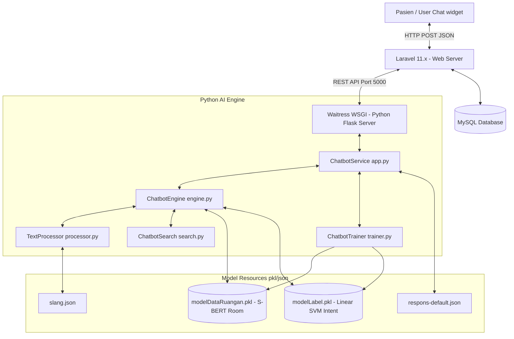
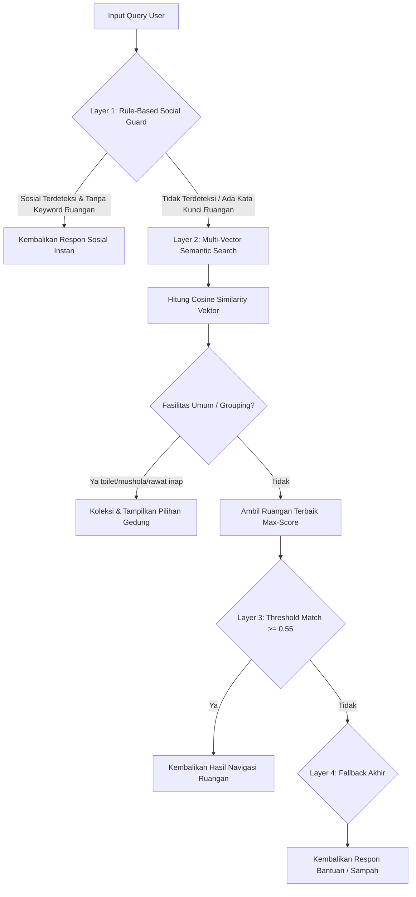

## DOKUMENTASI SISTEM

Sistem AI Chatbot RSJ Tampan mengadopsi model **Decoupled Architecture** yang memisahkan antara panel manajemen admin (Laravel) dengan mesin kecerdasan buatan (Python Flask + S-BERT). 

### Fitur Utama Sistem:
*   **Deep Hybrid Search (Akurasi 96.08%)**: Menggunakan paduan **S-BERT (bobot 70%)** dan **Fuzzy Lexical Match (bobot 30%)** yang dilengkapi algoritma *Booster* (pembobotan ekstra untuk kecocokan nama, kata kunci spesifik, lantai, dan gedung). Pendekatan *ensemble* ini terbukti mencapai akurasi pencarian ruangan hingga **96.08%** pada pengujian kueri kompleks yang realistis.
*   **Intent Classifier (S-BERT + Linear SVM)**: Mengklasifikasikan maksud kueri pengguna (5 kelas intent) menggunakan model hybrid. Dataset latih telah disempurnakan menjadi seimbang (160 sampel per label) dan dibersihkan dari duplikat untuk menghindari *data leakage*. Evaluasi membuktikan model sangat solid dengan akurasi **94.38%** di dunia nyata.
*   **Multi-Level Grouping (Lexical Search Integration)**: Penanganan kueri fasilitas umum majemuk (seperti "toilet" atau "rawat inap") secara cerdas dengan mendeteksi gedung secara otomatis dan menyajikan pilihan dinamis kepada pengguna.
*   **Hot-Reloading Dynamic Models**: Sinkronisasi data ruangan dari dashboard Laravel akan memicu *retraining* model S-BERT & Linear SVM secara *asynchronous* (di background thread), kemudian memuat ulang resource secara aman (`threading.Lock()`) tanpa menghentikan servis web (*no downtime*).
*   **Kurasi & Kontrol Kualitas Feedback (Anti-Poisoning)**: Administrasi log feedback dilengkapi dengan fitur seleksi massal (*bulk delete checkboxes*) dan konfirmasi modal interaktif untuk membuang pesan spam atau salah arah. Hal ini menjamin bahwa retraining model hanya menggunakan data umpan balik berkualitas tinggi (*high-fidelity curation*).
*   **Zero-Sync (Deferred Architecture)**: Admin CRUD beroperasi secara instan (non-blocking) dengan menaruh bendera sync tertunda ke cache. Pembaruan dan retraining model dilakukan di background pada request chat berikutnya, dengan perlindungan debounce 30 detik untuk efisiensi CPU maksimal.
*   **Dashboard Akurasi Ganda (Statis & Dinamis)**: Memisahkan antara akurasi ideal model dari hasil pengujian sains data (statis) dengan grafik kinerja dinamis berdasarkan interaksi umpan balik pengguna langsung (*real-world accuracy*).

---

## 2. Arsitektur Teknologi (Tech Stack)



---

## 3. Struktur File & Modul

Berikut adalah ringkasan singkat mengenai file utama dalam proyek, fungsi masing‑masing, serta hubungan antar modul.

| File | Lokasi | Deskripsi Singkat | Kaitan |
| ---- | ------ | ----------------- | ------ |
| `app.py` | `python_chatbot/bot_ai/` | Entrypoint Flask server, meng‑expose REST API untuk Laravel. | Memanggil `engine.py`. |
| `engine.py` | `python_chatbot/bot_ai/` | Core engine yang menerima query, intent detection & room search. | Menggunakan `processor.py`, `search.py`. |
| `processor.py` | `python_chatbot/bot_ai/` | Pre‑processing teks, slang translation, tokenisasi. | Dipanggil oleh `engine.py`. |
| `search.py` | `python_chatbot/bot_ai/` | Implementasi hybrid search (S‑BERT + Lexical Overlap & Keyword Boosting) serta ranking. | Dipanggil oleh `engine.py`. |
| `trainer.py` | `python_chatbot/bot_ai/` | Retraining model (room & intent) secara background. | Dipanggil via Laravel dashboard atau CLI. |
| `routes/web.php` | `routes/` (Laravel) | Definisi endpoint dan rute admin serta publik. | Meng-hubungkan GUI ke controller. |
| `ChatbotController.php` | `app/Http/Controllers/` | Controller thin yang delegasi ke service. | Memanggil service `ChatbotService`. |
| `ChatbotService.php` | `app/Services/` | Business logic, meng‑handle request, men‑trigger retraining. | Berinteraksi dengan model files & database. |
| `DataRuangan.php` | `app/Models/` | Eloquent model tabel `data_ruangans`. | Digunakan oleh service & trainer. |
| `slang.json` | `python_chatbot/model_resource/` | Kamus slang → standar. | Dipakai `processor.py`. |
| `Label Pertanyaan.xlsx` | `python_chatbot/model_resource/` | Dataset intent labeling. | Dipakai `trainer.py`. |
| `modelDataRuangan.pkl` / `LabelRespon.pkl` | `python_chatbot/model_resource/` | Model ter‑serialisasi. | Dimuat oleh `engine.py`. |

---

## 4. Landasan Teknis & Spesifikasi Implementasi 

### 4.1 Implementasi Lingkungan Kerja & Spesifikasi Teknologi

Sistem diimplementasikan menggunakan **Hybrid Decoupled Architecture** yang memisahkan antara *Web Management Layer* (Laravel) dan *AI Inference Layer* (Flask) untuk mengoptimalkan efisiensi beban kerja CPU pada sistem operasi Windows Server.

#### 4.1.1 Spesifikasi Technology Stack

| Komponen | Teknologi | Versi / Spesifikasi | Peran & Fungsi dalam Sistem |
| :--- | :--- | :--- | :--- |
| **Sistem Operasi** | Windows / Linux | Windows 10/11 / Server | Lingkungan dasar eksekusi web server dan Flask. |
| **Web Framework (Web)** | **Laravel** | 11.x | Menangani autentikasi admin, dashboard CRUD, manajemen feedback, dan GUI chat pasien. |
| **AI Web Framework** | **Python Flask** | 3.x | Menyediakan endpoint REST API untuk proses inferensi intent & pencarian hybrid semantik. |
| **WSGI Server** | **Waitress** | Production-ready | WSGI server multithreaded untuk Flask di platform Windows guna menjamin kestabilan konseptual *multi-user*. |
| **Web Server Stack** | **Laragon** (Apache) | Version 6+ | Menyediakan lingkungan terisolasi PHP 8.2+ dan Apache lokal secara instan. |
| **Database Server** | **MySQL** | 8.x | Menyimpan data ruangan, galeri foto ruangan, log interaksi chatbot, dan data feedback. |
| **Language Runtime** | **PHP** & **Python** | PHP $\ge$ 8.2, Python $\ge$ 3.10 | Interpreter utama eksekusi kode web dan mesin kecerdasan buatan. |

#### 4.1.2 Pustaka (Library) Kunci & Dependensi

##### A. AI & Data Processing Libraries (Python Environment)
*   **`sentence-transformers`**: Memuat model *pre-trained* `paraphrase-multilingual-MiniLM-L12-v2`. Bertanggung jawab mengubah input teks pengguna menjadi dense vector representatif berdimensi 384.
*   **`scikit-learn` (sklearn)**: Digunakan untuk evaluasi pemodelan SVM (`LinearSVC`) pada Intent Classification, serta komputasi Cosine Similarity antar-vektor dense secara real-time.
*   **`joblib`**: Pustaka serialisasi objek berkinerja tinggi untuk memuat (`load`) dan menyimpan (`dump`) data biner model (`LabelRespon.pkl` & `modelDataRuangan.pkl`) ke dalam memori RAM secara instan.
*   **`pandas` & `openpyxl`**: Mengelola pembacaan dataset berformat Excel (`Label Pertanyaan.xlsx`) yang menjadi basis data latih intents.
*   **`numpy`**: Melakukan manipulasi aljabar linier dan operasi matriks vektor representasi kata.

##### B. Frontend & Interface Libraries (Laravel Blade Environment)
*   **jQuery (v3.6.0+)**: Menangani asinkronisasi pengiriman pesan pasien (AJAX POST) dan pengelolaan efek dinamis modal galeri foto ruangan di frontend chat.
*   **Chart.js**: Digunakan pada dashboard admin untuk visualisasi statistik akurasi dinamis per hari.

#### 4.1.3 Framework & Spesifikasi Antarmuka (Frontend Stack)
*   **Template Engine**: **Laravel Blade Engine**. Layouting parsial (admin sidebars/modals), serta menyalurkan aset statis dinamis (`asset()`).
*   **CSS Framework & Styling**: **Vanilla CSS3** dengan pendekatan kustomisasi tingkat tinggi. Styling berfokus pada desain *hospital-branding* (sudut tumpul `border-radius: 18px`, efek bayangan lembut `box-shadow`, dan *Glassmorphism* pada modal).
*   **Penyelarasan Tata Letak (Layouting)**: Menggunakan **CSS Flexbox** dan **CSS Grid** untuk menyusun gelembung percakapan secara asimetris, galeri foto ruangan yang teratur, dan *form* manajemen admin secara responsif pada berbagai ukuran layar.
*   **Tipografi**: Menggunakan Google Fonts dengan keluarga font **Poppins** guna mempermudah keterbacaan teks petunjuk arah navigasi oleh pasien dari segala usia.
*   **Desain Responsif (Responsive Design)**: Mengimplementasikan *Mobile Viewport* (`width=device-width, initial-scale=1.0`) dan CSS Media Queries untuk memastikan antarmuka chat widget tampil layaknya aplikasi seluler (*mobile-app layout*) saat diakses menggunakan smartphone pasien.

---

### 4.2 Implementasi Strategi Inferensi (4-Layer Semantic Inference Architecture)

Strategi inferensi disederhanakan dari **8-Layer Priority Decision Waterfall** yang rumit dan berat menjadi **4-Layer Semantic Inference Architecture** yang jauh lebih elegan, cepat, dan presisi. 

Dengan mengganti model klasifikasi statistik (SVM & TF-IDF) ke pendekatan **Multi-Vector Semantic Embedding**, bot kini memahami makna implisit kalimat, toleran terhadap sinonim secara universal, dan sangat toleran terhadap *typo* berkat pemahaman kontekstual multibahasa.



1.  **Layer 1: Rule-Based Social Guard**
    Mendeteksi percakapan sosial deterministik (seperti menyapa: "halo", "terima kasih") menggunakan kamus reguler secara instan tanpa membebani inferensi model AI. Jika query hanya mengandung sapaan sosial tanpa kata kunci navigasi, respons sosial langsung dikembalikan.
2.  **Layer 2: Multi-Vector Hybrid Search (S-BERT 70% + Fuzzy 30%)**
    Query pengguna dibersihkan dari stopwords untuk memfokuskan model pada kata benda inti. Sistem menggunakan metode *Ensemble* yang menghitung nilai **Cosine Similarity S-BERT (bobot 70%)** digabungkan dengan proporsi irisan leksikal **Fuzzy Overlap (bobot 30%)**. Nilai akhir kemudian disempurnakan secara heuristik menggunakan kumpulan *Booster Rules* (tambahan skor signifikan jika tepat cocok dengan nama asli, mencocokkan kata kunci spesifik, spesifikasi lantai, serta arah dan nama gedung).
3.  **Layer 3: Threshold Match (Skor >= 0.55)**
    Mengambil ruangan dengan nilai kemiripan kosinus tertinggi. Jika nilai kemiripan melampaui ambang batas kepercayaan semantik (threshold >= 0.55), sistem secara otomatis mengembalikan ruangan tersebut beserta detail navigasinya.
4.  **Layer 4: Default Fallback**
    Jika tidak ada ruangan atau sapaan sosial yang terdeteksi dengan skor keyakinan yang cukup (skor < 0.55), sistem mengarahkan respons ke fallback terstandarisasi untuk meminta pengguna memperjelas nama ruangan yang dicari.

---

### 4.3 Implementasi Manajemen Dashboard & Smart Sync (MLOps)

Fungsionalitas Backend Dashboard (Laravel 11.x) tetap menjadi pusat kendali administrator untuk mengelola data operasional dan log aplikasi secara dinamis.

#### 4.3.1 Manajemen Data Ruangan & Media (CRUD)
Administrator dapat mengelola entitas ruangan secara dinamis (seperti menambah data ruangan medis baru, memasukkan foto petunjuk jalan, dan memperbarui kata kunci ruangan) langsung pada *dashboard*. Data ruangan yang tersimpan di dalam *database MySQL* ini merupakan *Single Source of Truth* operasional rumah sakit dan bahan baku dalam melatih otak algoritma.

#### 4.3.2 Mekanisme Auto-Retraining (Smart Sync Pipeline)
Mekanisme *Smart Sync Pipeline* merupakan pondasi *Machine Learning Operations* (MLOps) pada chatbot ini yang memungkinkan sinkronisasi *knowledge* antara database web dan *environment* Python secara *seamless* tanpa sentuhan *programmer*. Alurnya meliputi:
1.  Administrator memodifikasi basis data ruangan atau *keyword* pada *Dashboard* Laravel.
2.  Laravel secara otomatis memicu penjadwalan sinkronisasi melalui perantara **Zero-Sync Cache Flag**.
3.  Modul `trainer.py` pada flask menerima data, melakukan pra-pemrosesan teks, mengekstrak multi-vektor untuk setiap ruangan menggunakan `SentenceTransformer`, dan menyimpannya ke dalam file model `.pkl` secara real-time.
4. Usai proses pemodelan yang sangat cepat, server Python memuat ulang (*hot-reload*) representasi model terbaru ke dalam memori aplikasi sehingga bot langsung menjadi "lebih cerdas" memproses percakapan baru tanpa adanya jeda atau *downtime* layanan.

---

### 4.4 Implementasi Mekanisme Feedback & Filter Kualitas Data (Anti-Poisoning)

Untuk memastikan akurasi chatbot tidak terdegradasi oleh masukan sampah atau kesalahan pengguna, sistem mengimplementasikan manajemen feedback yang ketat pada Admin Dashboard:

1.  **Mekanisme Perekaman Umpan Balik**: Sistem mencatat pesan pengguna, hasil tebakan intent, ID ruangan terprediksi, dan status akurasi langsung dari pengguna.
2.  **Filter Kualitas Data & Bulk Action**: Dashboard dilengkapi kotak centang (*checkboxes*) seleksi massal dan tombol aksi hapus interaktif dengan pop-up konfirmasi.
3.  **Tujuan Anti-Poisoning**: Fitur ini memungkinkan admin bertindak sebagai kurator data (*data curator*) untuk membuang percakapan spam atau salah asah sebelum model melatih dirinya sendiri kembali.

---

### 4.5 Implementasi Zero-Sync (Asynchronous Deferred Training Pipeline)

Untuk menanggulangi kelambatan antarmuka admin akibat kompilasi model AI yang berat, sistem dilengkapi arsitektur **Zero-Sync**:

*   **Deferred Execution (Penangguhan Eksekusi)**: Ketika admin melakukan CRUD ruangan, sistem tidak langsung memicu proses HTTP POST yang memblokir respons. Sebaliknya, sistem hanya menaruh flag penangguhan (`chatbot_sync_pending`) di cache memori Laravel yang berjalan sekejap (~1ms).
*   **Just-in-Time Prediction Sync**: Saat pengguna berikutnya mengirim chat, method `predict()` mendeteksi bendera tertunda ini, melunasi sinkronisasi model (`syncModels()`), lalu meluncurkan prediksi. User selalu dijamin mendapatkan model AI paling segar.
*   **Debouncing Lock**: Panggilan `syncModels()` dibatasi dengan kunci durasi 30 detik (`SYNC_DEBOUNCE`). Jika admin melakukan sunting massal ruangan (misal 10 ruangan sekaligus), hanya akan terjadi 1 kali siklus sinkronisasi dan retraining ke Flask.

---

## 5. Panduan Pemeliharaan & Update Sistem (Maintenance Guide)

Untuk memastikan kelancaran operasional jangka panjang, Tim SIMRS wajib memahami mekanisme penambahan data baru berikut agar performa chatbot tidak mengalami degradasi:

### A. Menambahkan Kata Gaul/Typo Baru (`slang.json`)
Apabila dalam log interaksi pasien sering ditemukan kata-kata salah ketik baru atau istilah lokal (misal: `"prikotik"` untuk `"psikotik"`), Anda tidak perlu melatih ulang model AI. Cukup ikuti panduan berikut:
1.  Buka file `python_chatbot/model_resource/slang.json`.
2.  Tambahkan pasangan kata kunci baru pada bagian paling bawah dengan format huruf kecil semua:
    ```json
    "prikotik": "psikotik",
    "klinik jiwo": "klinik jiwa"
    ```
3.  Simpan file. Saat pengguna mengetik kata tersebut berikutnya, `TextProcessor` akan secara instan meresolusi kata tersebut ke bahasa baku sebelum dibaca oleh otak semantik.

### B. Menambahkan Kueri Intent Baru (`Label Pertanyaan.xlsx`)
Jika Anda ingin menambahkan variasi pola sapaan, identitas, atau penutup baru ke dalam sistem chatbot:
1.  Buka dokumen `python_chatbot/model_resource/Label Pertanyaan.xlsx` menggunakan Microsoft Excel.
2.  Tambahkan pertanyaan baru di baris paling bawah. Pastikan mengisi kolom `Pertanyaan` dengan kalimat alami dan kolom `Label` dengan salah satu dari 5 intent standar:
    *   `sapaan` (e.g., "halo bot", "selamat pagi")
    *   `identitas` (e.g., "siapa kamu", "nama kamu siapa")
    *   `cari_ruangan` (e.g., "dimana letak apotek", "rute ke poli anak")
    *   `penutup` (e.g., "terima kasih", "bye")
    *   `sampah` (e.g., "asdfghjkl", "tidak jelas")
3.  Simpan dokumen. Setelah itu, lakukan pemanggilan Retraining melalui Dashboard Laravel dengan menekan tombol **"Sinkronisasi Dataset"** atau jalankan perintah CLI.

### C. Menjalankan Retraining Model Secara Manual (Command Line)
Apabila tombol sinkronisasi dashboard admin Laravel mengalami gangguan, administrator dapat memicu pembuatan ulang file pikel `.pkl` secara manual langsung dari terminal server Python:
```powershell
# 1. Aktifkan virtual environment
.\venv\Scripts\activate

# 2. Jalankan perintah kompilasi ulang database ruangan dan intent
python -c "
import mysql.connector, pandas as pd
from python_chatbot.bot_ai.trainer import ChatbotTrainer
conn = mysql.connector.connect(host='127.0.0.1', user='root', password='', database='chatbot')
df = pd.read_sql('SELECT id, nama_ruangan, nama_gedung, kategori, fungsi_ruangan, navigasi, kata_kunci FROM data_ruangans ORDER BY id', conn)
conn.close()
trainer = ChatbotTrainer()
ok_room = trainer.train_rooms(df.to_dict('records'))
ok_intent = trainer.train_intent()
print(f'Retraining Sukses! Room: {ok_room} | Intent: {ok_intent}')
"
```

---

## 6. Troubleshooting & Solusi Kendala Umum

#### 1. Masalah: Kecepatan Respon Melambat saat Server Pertama Kali Dijalankan
*   **Penyebab**: SentenceTransformer sedang mengunduh model `paraphrase-multilingual-MiniLM-L12-v2` dari repositori Hugging Face ke folder cache server lokal.
*   **Solusi**: Pastikan koneksi internet server stabil pada eksekusi pertama. Setelah terunduh sempurna, sistem akan beralih ke mode luring penuh (*offline mode*) menggunakan cache lokal tanpa memakan kuota internet atau bandwidth.

#### 2. Masalah: Error `KeyError: 'room_metadata'` di Server Python
*   **Penyebab**: File `modelDataRuangan.pkl` yang dimuat adalah versi usang yang tidak memiliki struktur metadata ruangan lengkap (`room_metadata`).
*   **Solusi**: Jalankan perintah **"Retraining Model Secara Manual"** (seperti pada Bagian 5.C) untuk mengompilasi ulang pikel ruangan dengan menyertakan metadata terbaru secara otomatis.

#### 3. Masalah: CPU Usage melonjak 100% saat Retraining
*   **Penyebab**: S-BERT melakukan kalkulasi embedding semantik secara paralel pada seluruh data ruangan. Hal ini wajar dan hanya berlangsung selama 3-5 detik saja.
*   **Solusi**: Karena proses ini telah didesain berjalan di *background thread* (`threading.Thread`) secara *asynchronous*, pengguna chatbot aktif tidak akan merasakan jeda atau penurunan performa sama sekali (*zero downtime*).

---

## 7. Kontribusi Terhadap Standar Akreditasi Rumah Sakit (STARKES)

AI Chatbot Navigasi RSJ Tampan berkontribusi aktif dalam pemenuhan standar pelayanan kesehatan nasional:
1.  **MKE (Manajemen Komunikasi dan Edukasi - MKE 1)**: Menyediakan sistem informasi pelayanan terpadu dan penunjuk arah yang mudah dipahami, transparan, serta ramah bagi pengunjung dan pasien disabilitas/rawat jalan.
2.  **PMKP (Peningkatan Mutu dan Keselamatan Pasien - PMKP 3)**: Mengurangi kecemasan lingkungan (*environmental stress*) pada pasien gangguan jiwa akibat kebingungan navigasi arah bangunan yang luas. Mutu layanan meningkat seiring dengan merosotnya angka keterlambatan pasien masuk ke unit pelayanan medis rujukan.
3.  **ARK (Akses ke Rumah Sakit dan Kontinuitas Pelayanan - ARK 1)**: Mengatur efisiensi alur perpindahan pasien (*patient flow*) dari pintu masuk utama rumah sakit langsung ke ruangan spesifik instalasi penunjang medis dengan instruksi jalan yang tepat.

---
                      "perawat","suster","humas","komite","iprs","cssd","pkm",
                      "depo","hemodialisa","fisioterapi","ekg","vct","isolasi"}
